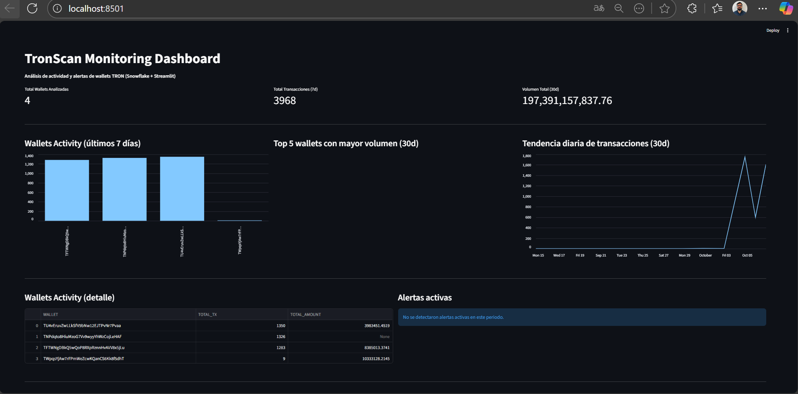
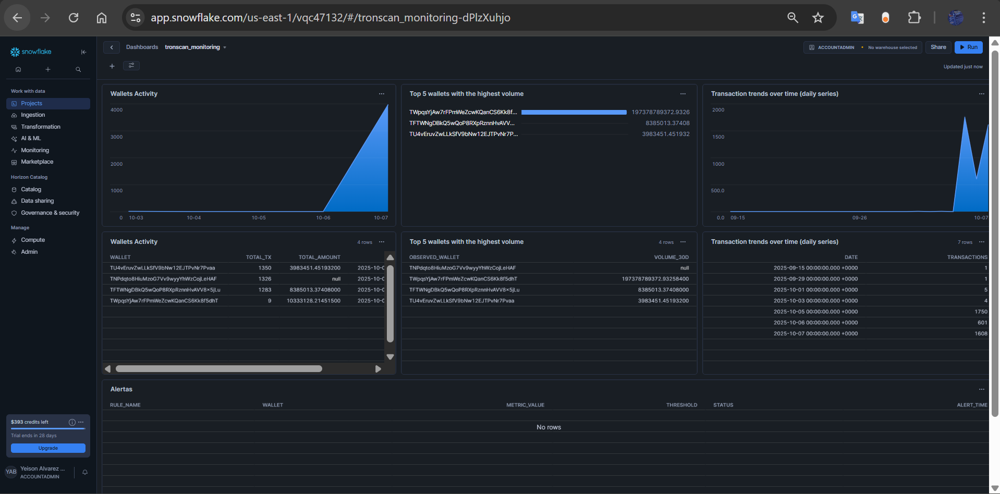

# TRONSCAN MONITORING PIPELINE
---

## Descripción General

Este proyecto implementa un pipeline de monitoreo de transacciones en la red TRON.  
El sistema extrae información desde la API pública de TronScan, la transforma a un esquema estructurado, la carga en Snowflake y aplica reglas de negocio para identificar comportamientos relevantes o anómalos.

El objetivo es demostrar la capacidad de construir una solución de análisis y detección basada en datos reales, con enfoque modular, auditable y automatizado.


## Estructura del Proyecto
```
tronscan-monitoring/
│
├── src/
│ ├── config/
│ ├── extract/
│ ├── transform/
│ ├── load/
│ ├── alerts/
│ ├── dashboard/
│ └── anomaly/
│
├── out/
│ ├── raw/
│ ├── structured/
│ ├── alerts/
│ └── anomalies/
│
├── logs/
│
├── sql/
│
├── requirements.txt
├── .env
└── README.md
└── README_IA.md
```

### Preparación e Instalación

- Python 3.10 – 3.11  
- Cuenta Snowflake activa  
- Dependencias indicadas en `requirements.txt`

### Instalación

```bash
python -m venv venv
venv\Scripts\activate
pip install -r requirements.txt
```

### Ejecución

```bash
python -m src.main
```

El pipeline realiza:

* Extracción de datos de TronScan.
* Transformación y normalización.
* Carga en Snowflake.
* Aplicación de reglas de negocio.
* Exportación de alertas y anomalías.
* Ejecución periódica cada 10 minutos.

## Monitoreo Streamlit
```bash
streamlit run src/dashboard/dashboard_app.py 
```


## Commit 1: Estructura inicial del proyecto.
 Con la ayuda de ChatGPT, se solicito un plan detallado de estructura para iniciar el pipeline. Manualmente se realiza la creación de carpetas y archivos requereridos.


## Commit 2: Extract
Se construyó, con apoyo de herramientas de IA, el módulo de extracción de transacciones de wallets TRON desde la API pública de TronScan.
Diseño del plan:
Generación de código base:
Con IA obtuve ejemplos y plantillas iniciales para:
- La clase TronScanClient en src/extract/tronscan_client.py.
- El cargador de wallets load_wallets() en src/config/config_loader.py.
- El módulo raw_saver.py para guardar datos crudos en JSON.
- El script main.py para ejecutar la extracción y ver resultados.

Ajustes y refactors:
A partir de las sugerencias del asistente, revisé y adapté:
- La paginación de la API.
- El uso de httpx para peticiones HTTP.
- La configuración de logging básico para reemplazar print() y dar visibilidad en consola.

Los datos crudos se guardan en:

```
out/raw/
```

## Commit 3: Transform
Se definió un esquema estructurado para las transacciones mediante un modelo Transaction en Pydantic, que garantiza tipos consistentes (timestamp UTC, amount como Decimal, campos normalizados).
Se implementó la función parse_transaction que transforma los datos crudos extraídos en objetos validados.
Se probó la transformación integrándola en main.py, mostrando ejemplos de transacciones ya normalizadas y guardándolas opcionalmente en out/structured/ para depuración.

Esquema estructurado
| Campo           | Tipo      | Descripción                           |
| --------------- | --------- | ------------------------------------- |
| transaction_id  | STRING    | Identificador único de la transacción |
| observed_wallet | STRING    | Wallet monitoreada                    |
| to_address      | STRING    | Dirección destino                     |
| token_symbol    | STRING    | Token o activo transferido            |
| amount          | DECIMAL   | Monto de la transacción               |
| timestamp_utc   | TIMESTAMP | Fecha y hora (UTC)                    |
| contract_type   | STRING    | Tipo de contrato                      |
| confirmed       | BOOLEAN   | Estado de confirmación                |

Ejemplo de salida estructurada:

```json
{
  "transaction_id": "df6e9b2f3aa84f7e86d7",
  "observed_wallet": "TNPdqto8HiuMzoG7Vv9wyyYhWzCojLeHAF",
  "to_address": "TTAj2srvvr9uUfB5itNYyvcfzipdRhTpCe",
  "token_symbol": "TRX",
  "amount": 10350.75,
  "timestamp_utc": "2025-10-05T14:23:19Z",
  "contract_type": "TransferContract",
  "confirmed": true
}
```


## Commit 4: Load
Se implementó el módulo de carga de datos transformados hacia Snowflake. Se buscó persistir en una base de datos las transacciones extraídas y normalizadas en las fases anteriores.

Se configuró un entorno Python 3.11 compatible con snowflake-connector-python y se añadieron las credenciales de Snowflake en un archivo .env seguro.

Se desarrolló la clase SnowflakeLoader en src/load/snowflake_loader.py:
Establece la conexión con Snowflake usando las credenciales.
Ejecuta USE DATABASE y USE SCHEMA para fijar el contexto.
Crea automáticamente la tabla TRANSACTIONS si no existe, con las columnas:
* TX_ID (STRING, clave primaria)
* TIMESTAMP_UTC (TIMESTAMP_TZ)
* FROM_ADDRESS (STRING)
* TO_ADDRESS (STRING/NULLABLE)
* TOKEN (STRING)
* AMOUNT (NUMBER(38,8))
* OBSERVED_WALLET (STRING)
* RAW (VARIANT con el JSON original)
Inserta cada transacción fila por fila usando PARSE_JSON para la columna RAW, garantizando compatibilidad y evitando errores de multi-row insert.
Se actualizó main.py para que, después de extraer y transformar con parse_transaction, llame a loader.insert_transactions(structured_transactions) y cargue los datos en Snowflake.
Se ajustó el modelo Transaction para permitir valores NULL en campos opcionales como to_address, evitando fallos de validación.

Los logs de ejecución se guardan en:
```
logs/etl_tronscan.log
```


## Commit 5: Orquestación y Monitoreo en Snowflake
El objetivo principal fue asegurar que las cargas de datos estructurados provenientes del ETL Python se mantengan sincronizadas, auditables y con capacidad de autogestión dentro de Snowflake.

### Automatización del flujo en Snowflake
Se implementó un mecanismo completo de ejecución automática directamente en Snowflake, compuesto por:

Procedimiento almacenado
UPDATE_WALLET_METRICS()
Genera o actualiza la tabla agregada WALLET_METRICS, resumiendo la actividad por cada wallet monitoreada.
Incluye métricas como:
* Total de transacciones (TOTAL_TX)
* Tokens únicos utilizados (TOKENS_UNICOS)
* Última transacción (ULTIMA_TX)
* Monto total transado (MONTO_TOTAL)

Task programada
REFRESH_WALLET_METRICS
Ejecuta el procedimiento automáticamente cada 15 minutos, manteniendo las métricas actualizadas en paralelo al ciclo del ETL.
La task se configura con:
```bash
CREATE OR REPLACE TASK REFRESH_WALLET_METRICS
  WAREHOUSE = COMPUTE_TRON_WH
  SCHEDULE = '15 MINUTE'
  AS CALL UPDATE_WALLET_METRICS();
```
Esta integración garantiza que la base analítica de Snowflake se mantenga sincronizada con los datos cargados desde el pipeline Python.

### Creación de vista de métricas
Se implementó la vista WALLET_METRICS_VIEW, que sirve como punto central para análisis, dashboards o herramientas externas como Power BI, Snowsight o Dataiku.

Campos principales:
* OBSERVED_WALLET – dirección monitoreada
* TOTAL_TX – total de transacciones registradas
* TOKENS_UNICOS – cantidad de tokens distintos
* ULTIMA_TX – fecha/hora de la última transacción
* MONTO_TOTAL – monto agregado
* MINUTOS_DESDE_ULTIMA_TX – tiempo desde la última actividad
Esta vista facilita consultas rápidas sin necesidad de recalcular las métricas cada vez.

### Monitoreo y alertas de fallos
Se añadió una segunda task para monitorear la salud del pipeline Snowflake:

Task: ALERT_TASK_FAILURES
* Corre cada 1 hora.
* Consulta el TASK_HISTORY() de Snowflake.
* Registra en la tabla ALERT_LOGS todas las ejecuciones fallidas durante las últimas 2 horas.

```bash
INSERT INTO ALERT_LOGS (TASK_NAME, STATE, ERROR_CODE, ERROR_MESSAGE)
SELECT NAME, STATE, ERROR_CODE, ERROR_MESSAGE
FROM TABLE(INFORMATION_SCHEMA.TASK_HISTORY())
WHERE STATE = 'FAILED'
  AND SCHEDULED_TIME >= DATEADD('hour', -2, CURRENT_TIMESTAMP());
```
Esto permite mantener un registro histórico de errores y habilita futuras integraciones con sistemas de notificación o monitoreo externo.

### Validación y supervisión de las tareas
Se creó un script SQL (check_etl_tasks.sql) para monitorear el estado del ecosistema ETL, con consultas a:
* SHOW TASKS → Ver tareas activas y su programación.
* DESCRIBE TASK → Inspeccionar configuración detallada.
* TABLE(INFORMATION_SCHEMA.TASK_HISTORY(...)) → Revisar historial de ejecuciones.
* ACCOUNT_USAGE.QUERY_HISTORY → Analizar queries ejecutadas por cada task.
Estas consultas permiten verificar fácilmente si las tareas se ejecutan correctamente, cuándo fue la última ejecución exitosa y cuánto tardaron.

### Logging y visibilidad
* Los registros del ETL se mantienen en logs/etl_tronscan.log con salida simultánea en consola.
* Cada ejecución muestra el ciclo completo: Extracción → Transformación → Carga → Task Snowflake → Cierre de conexión.
Se validó la consistencia entre los datos locales (out/structured/) y los almacenados en la tabla TRANSACTIONS.

### Flujo completo del pipeline
```bash
    A[ETL Python cada 15 min] -->|Carga| B[Tabla TRANSACTIONS]
    B -->|Ejecución automática| C[Task REFRESH_WALLET_METRICS]
    C -->|Actualiza| D[Tabla WALLET_METRICS]
    D --> E[Vista WALLET_METRICS_VIEW]
    B -->|Monitoreo| F[Task ALERT_TASK_FAILURES]
    F --> G[Tabla ALERT_LOGS]
    G -->|Consulta| H[Snowsight / Dashboard / Alertas]
```
## Commit 6: alert rules (Transaction Count y Volume)
Se implementa la **lógica de detección de comportamientos anómalos** mediante reglas de negocio directamente en **Snowflake**, con el objetivo de generar alertas cuando las wallets superen umbrales definidos de actividad o volumen transaccionado.

---

### Objetivo

Detectar de forma automática patrones de comportamiento inusuales en las wallets monitoreadas:

- **Transaction Count Rule** → cuando una wallet realiza más de *N* transacciones en una ventana de tiempo.  
- **Transaction Volume Rule** → cuando una wallet transfiere más de *X* unidades de valor en una ventana determinada.  

Ambas reglas se ejecutan de forma recurrente mediante **Snowflake Tasks**, generando alertas que posteriormente son exportadas a JSON en la Fase 5.

---

### Estructura implementada

Se añadieron tres componentes principales dentro del esquema `TRANSACTIONS`:

| Componente | Descripción |
|-------------|-------------|
| **`ALERT_THRESHOLDS`** | Tabla de parámetros que define los umbrales por regla y periodo (7 y 30 días). |
| **`CHECK_WALLET_RULES()`** | Procedimiento que evalúa ambas reglas y registra las alertas detectadas. |
| **`CHECK_WALLET_RULES_TASK`** | Task automática que ejecuta el procedimiento cada 15 minutos. |

---

### Procedimiento CHECK_WALLET_RULES()
Evalúa los datos en la tabla TRANSACTIONS y registra las alertas que superen los límites establecidos:
```sql
CREATE OR REPLACE TABLE ALERT_THRESHOLDS (
    RULE_NAME STRING PRIMARY KEY,
    PERIOD_DAYS INT,
    THRESHOLD FLOAT
);

INSERT INTO ALERT_THRESHOLDS VALUES
  ('Transaction Count Rule - 7d', 7, 100),
  ('Transaction Count Rule - 30d', 30, 300),
  ('Transaction Volume Rule - 7d', 7, 500000),
  ('Transaction Volume Rule - 30d', 30, 2000000);
```
### Task de ejecución periódica
Esta tarea se encarga de lanzar las reglas cada 15 minutos:}
```sql
CREATE OR REPLACE TASK CHECK_WALLET_RULES_TASK
  WAREHOUSE = COMPUTE_TRON_WH
  SCHEDULE = '15 MINUTE'
AS
  CALL CHECK_WALLET_RULES();
```

## Commit 7: alert JSON

### Objetivo
Implementar un sistema de alertas basado en reglas de negocio para detectar comportamientos anómalos en las transacciones, exportando los resultados a archivos JSON trazables.

---

### Descripción
Se integró un módulo `alert_exporter.py` que consulta las reglas aplicadas en Snowflake (`ALERT_RULES_VIEW`) y genera un archivo JSON con las alertas activas tras cada ejecución del ETL.

Cada alerta incluye:
- **wallet** → ID de la billetera observada  
- **rule** → Regla violada (`transaction_count` o `transaction_volume`)  
- **value / threshold** → Valor medido y límite establecido  
- **timestamp** → Fecha y hora de evaluación  

Ejemplo de salida:
```json
[
  {
        "WALLET": "TU4vEruvZwLLkSfV9bNw12EJTPvNr7Pvaa",
        "RULE": "Transaction Volume Rule",
        "VALUE": 907810.378399,
        "THRESHOLD": 500000.0,
        "TIMESTAMP": "2025-10-05 18:11:06.625000"
  }
]
```

## Commit 8: Snowflake/Python-streamlit Dashboard, Anomalies and documentation

### Snowflake/Python-streamlit Dashboard

Se construye dashboard interactivo en Streamlit conectado directamente a Snowflake, para visualizar en tiempo real la actividad de wallets, las métricas transaccionales y las alertas generadas por el pipeline ETL. Tambien se contruye un dashboard en snowflake.

---

El dashboard combina datos de las tablas:
- `TRANSACTIONS`
- `WALLET_METRICS_VIEW`
- `ALERT_RULES_VIEW`

Y ofrece una vista unificada del comportamiento transaccional de las wallets TRON monitoreadas en los últimos días.

---

### Configuración y conexión

1. En el entorno virtual del proyecto, instala los paquetes requeridos:
   ```bash
   pip install streamlit snowflake-connector-python pandas python-dotenv

2. Ejecutar:
    ```bash
    streamlit run src/dashboard/dashboard_app.py

## Vista del Dashboard Streamlit

---
## Vista del Dashboard Snowflake



### Anomalies

### Reglas heurísticas aplicadas

1. **Large Transaction**  
   Identifica transacciones cuyo monto es significativamente mayor al patrón histórico de su misma wallet.  
   - Umbral: `amount > median + 3 × std`  
   - Métrica calculada por wallet con base en los últimos 30 días.

2. **Burst Activity**  
   Detecta incrementos súbitos en la frecuencia de transacciones.  
   - Umbral: `frecuencia_24h > 2 × promedio_7d`

3. **New Counterparty**  
   Marca transferencias realizadas a una wallet receptora que no había sido vista antes.  
   - Evalúa pares `(observed_wallet, to_address)` nuevos en el histórico.

---

### Ejemplo de salida

Cada transacción sospechosa se exporta a un archivo JSON dentro de `out/anomalies/`, con estructura uniforme y auditable:

```json
[
  {
    "wallet": "TYYYYYY",
    "transaction_id": "123abc",
    "anomaly_type": "large_transaction",
    "amount": 50000,
    "reason": "El monto es 10 veces mayor que la mediana histórica"
  },
  {
    "wallet": "TZZZZZZ",
    "transaction_id": "456def",
    "anomaly_type": "new_counterparty",
    "amount": 1250,
    "reason": "Transferencia a una wallet receptora no vista anteriormente"
  }
]
```

### USO DE IA

En este proyecto, la IA se utilizó de manera estratégica para acelerar el desarrollo y mejorar la claridad del código y la documentación.

1. Diseño de arquitectura y flujo ETL

* Se empleó ChatGPT (GPT-5) para generar un esquema inicial del proyecto con la estructura modular: extract → transform → load → alert.

* Ejemplo de prompt utilizado:
```
“Diseña un flujo ETL en Python para obtener transacciones desde TronScan API, estructurarlas y cargarlas en Snowflake con alertas automáticas.”
```

2. Refactorización de código

* Se optimizó la clase SnowflakeLoader con soporte para reconexión y logging detallado.

* ChatGPT ayudó a resolver errores del tipo “Binding data in type (dict) is not supported” y “Cannot perform CREATE TABLE” al ajustar el formato de los parámetros.

3. Generación de documentación

* La mayoria de secciones del README.md fueron redactadas y formateadas con ayuda de IA, garantizando consistencia entre fases y claridad en la descripción de reglas, tareas y métricas.

4. Asistencia en depuración

* Durante el desarrollo se utilizaron respuestas del modelo para interpretar errores de Snowflake (por ejemplo, invalid identifier o SQL compilation error) y corregir consultas SQL.

5. Prototipado de dashboard

* La IA generó un ejemplo funcional de dashboard en Streamlit con gráficos basados en las métricas existentes.

Partes generadas o inspiradas por IA
| Componente                   | Tipo de asistencia      | Descripción                               |
| ---------------------------- | ----------------------- | ----------------------------------------- |
| `transformer.py`             | Refactorización         | Normalización de campos y tipificación    |
| `snowflake_loader.py`        | Generación + corrección | Conexión, inserción y tareas automáticas  |
| `alert_exporter.py`          | Co-creación             | Estructura de consulta y exportación JSON |
| `anomaly_detector.py`        | Inspiración             | Definición heurística de anomalías        |
| `README.md`                  | Redacción asistida      | Documentación técnica detallada           |

El uso de IA en este ejercicio no reemplazó el razonamiento técnico, sino que potenció la creatividad, productividad y consistencia del código.